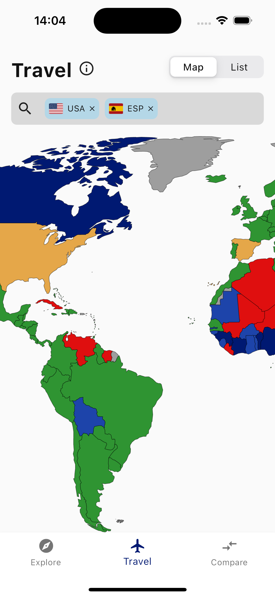

# PassportHub


PassportHub is a mobile application designed to enhance the travel experience by providing users with the power to
explore, compare, and understand passport strengths and visa-free travel opportunities.

Leveraging Bloc pattern for state management and a feature-based folder structure, PassportHub ensures a scalable,
maintainable, and clean codebase.

> Live demo is available at:
> https://passporthub-ec83e.web.app/

## Table of Contents

- [Getting Started](#getting-started)
- [Features](#features)
- [Architecture](#architecture)

## Getting Started

To get started with PassportHub, ensure you have Flutter installed on your machine. Clone the repository, and then:

```bash
flutter pub get
flutter run
```

## Features

1. Explore global passport rankings.
    - 
2. Discover to which countries you and your international friends can travel with visa-free
    - 

3. Check visa requirements for a country.
    - 

- Compare the passport strength between two countries. [SOON]
- Bloc pattern for predictable state management.
- Bloc tests to ensure functionality and performance.
- Feature-based folder structure for better modularity.

## Architecture

PassportHub adopts a feature-based Foldering structure, this ensures both:

1. Each feature is easily accessible and provides encapsulation.

2. Makes it trivially easier to understand a feature since everything is in a single folder.

3. Uses open source data provided by [ilyankou](https://github.com/ilyankou/passport-index-dataset)